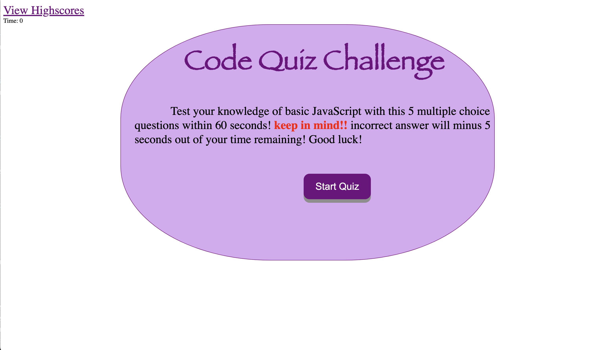
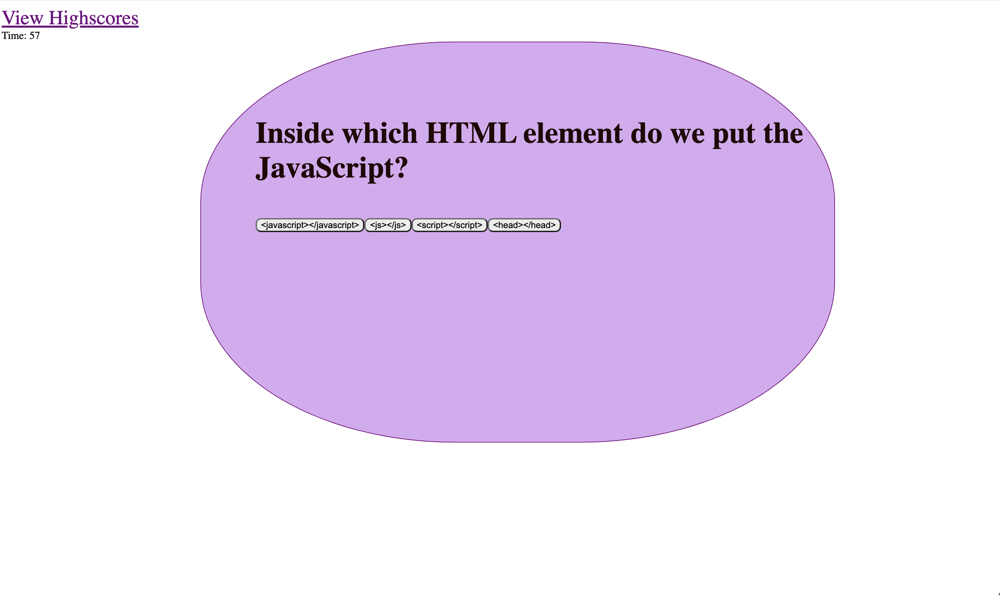
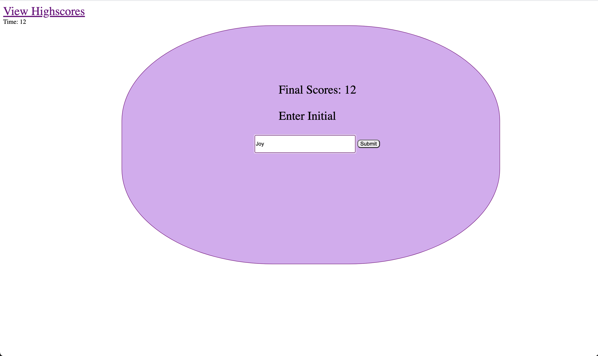
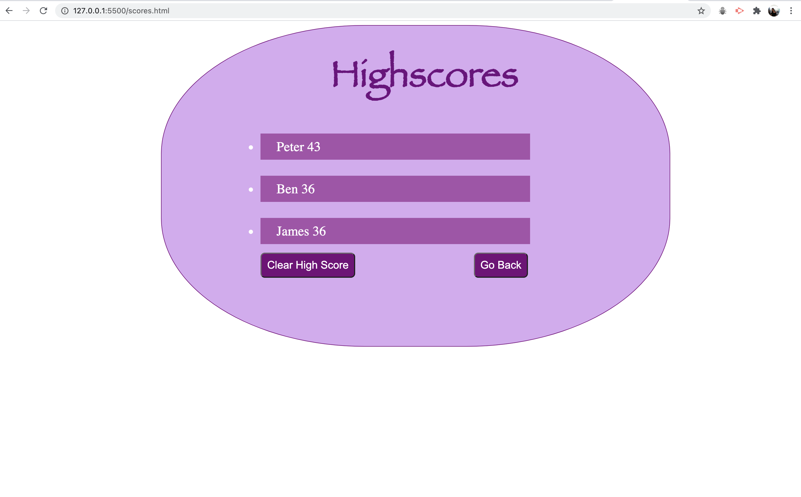

# codeQuiz2 

## Table of Content

* [Description](#Description )
* [Usage Information](#Usage-Information)
* [License](#License)
* [Contributing Guildline](#Contributing-Guildline)
* [Tests Instructions](#Tests-Instructions)
* [Link to The Project Site](#Link-to-the-project-site)

## Description
* This project is a timed coding quiz with multiple-choice questions. This app feature dynamically updated HTML and CSS powered by JavaScript code.

## Usage Information
* A user will be able to take a timed quiz on JavaScript fundamentals that stores high scores and user's initials.

## License

## Contributing Guildeline
* I encourage public contributions.

## Tests Instructions
* When a user clicks the Start Quiz button, the application will present the user with multiple-choice questions, and the timer will start counting down.  

 

* If the user clicks a wrong answer, the timer will be deleted 5 seconds. 
* After the user answered all the questions, the time remaining is the user's score. And if the timer reaches 0, the game is over.

 

* After the user answered all the questions,the application will show the user's scores and the user will be able to input their initials to be stored along with their scores. 

 

 

## Link to the project site. 
* https://saipurciful.github.io/codeQuiz2/
